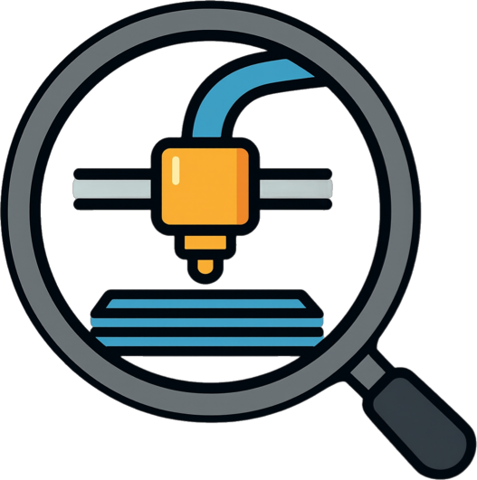

#  PrintSpy
   

A self-hosted dashboard for monitoring multiple 3D printers — OctoPrint and PrusaLink — from a single web interface.

This has been created mostly for my own use. If someone else finds it useful, all the better. If you would like to contribute, please be my guest. I only have Prusa printers and can only test with those. 

> **Early Development** — expect rough edges, breaking changes, and evolving APIs. Feedback and contributions welcome.

## What it does

Each printer gets a row: webcam/snapshot, GCode thumbnail, progress/ETA, temps, layer progress (OctoPrint + DisplayLayerProgress), and smart plug power state/control. Updates push live via SSE. Everything's configured through the settings page — no config files, no restart needed.

## Features

- Real-time SSE updates, no manual refresh
- Auto-detects camera stack, printer name, and installed plugins
- Works with [printspy-cam](https://github.com/ccmpbll/printspy-cam) (ESP32-CAM firmware) for a webcam feed on printers with no native camera support, like PrusaLink
- Smart plug power control + energy monitoring — auto-detected via OctoPrint (Tasmota, PSU Control), or talk directly to a Tasmota device independent of any plugin, assignable to any printer type
- Print control (pause/resume/cancel) and one-click reprint from recent files, with success/failure stats per file (native on OctoPrint, backfilled from print history on PrusaLink)
- Auto-off after idle timeout and thermal runaway protection (second layer on top of firmware protection) for printers with an assigned smart plug
- PrusaLink keepalive ping — works around printers whose wifi drops off after sitting idle
- Optional free-text "model" field to group physically-alike printers on the dashboard
- Slicer print-host target — point PrusaSlicer/OrcaSlicer's "Send to printer" (PrusaLink mode) at PrintSpy; it stages the file and powers on/dispatches to a printer you pick (or automatically, if pinned to one printer)
- Multi-user login with per-account passwords, no roles/tiers
- Config backup/restore as YAML
- Snapshot/live toggle, printer reordering, dark mode, responsive layout
- Multi-arch (x86 + ARM)

## Supported platforms

- **OctoPrint** — fully supported
- **PrusaLink** — experimental (Only tested on MK4S and Core One)

Plugin architecture — new platforms are straightforward to add.

## Quick start

```bash
docker run -d \
  --name printspy \
  -p 8080:8080 \
  -v printspy-data:/data \
  ccmpbll/printspy:latest
```

Open `http://localhost:8080` — first run prompts you to create a login. Once in, click the settings gear and add your first printer. You'll need the printer's URL and OctoPrint API key.

### Docker Compose

```yaml
services:
  printspy:
    image: ccmpbll/printspy:latest
    ports:
      - "8080:8080"
    volumes:
      - printspy-data:/data
    restart: unless-stopped

volumes:
  printspy-data:
```

## Configuration

All printer management is done through the web UI — open the settings page to add, edit, reorder, and remove printers. No config files needed.

### Login

First run redirects to a setup page to create the first account. Add or remove additional users from Settings → Users. No roles or permission tiers — every account has full access.

### Smart plugs

OctoPrint printers with the Tasmota or PSU Control plugin installed get power control automatically — nothing to configure. For everything else (PrusaLink, Klipper, or an OctoPrint printer without the plugin), add a Tasmota device directly under Settings → Smart Plugs and assign it to a printer. Plugs are managed independently of printers, so deleting a printer unassigns its plug instead of deleting it.

### Cameras

Any printer type can get a webcam feed by assigning a [printspy-cam](https://github.com/ccmpbll/printspy-cam) device under Settings → Cameras — useful for PrusaLink, which has no webcam support of its own. Assigning a camera overrides whatever webcam a printer's own plugin would otherwise show. Cameras are managed independently of printers, so deleting a printer unassigns its camera instead of deleting it.

### Environment variables

| Variable | Default | Description |
|----------|---------|-------------|
| `PRINTSPY_PORT` | `8080` | HTTP server port |
| `PRINTSPY_DATA_DIR` | `/data` | SQLite database location |

## Getting your OctoPrint API key

1. Open your OctoPrint web interface
2. Go to **Settings** (wrench icon) → **API**
3. Copy the **Global API Key**, or create a new one under **Application Keys**

## Tech stack

- **Go** backend — single binary, low resource usage
- **SQLite** — no external database needed
- **Vanilla HTML/CSS/JS** frontend — no build step, no framework
- **Docker** — multi-arch container (amd64 + arm64)

## Building from source

```bash
# Requires Go 1.25+ and CGO (for SQLite)
make build

# Or with Docker
make docker
```

## Contributing

PrintSpy is in early development. If you'd like to contribute:

- Open an issue to discuss before submitting large changes
- Bug reports with `docker logs` output are especially helpful
- Plugin implementations for Moonraker/Klipper are welcome

## License

AGPL-3.0 — see [LICENSE](LICENSE) for details.
